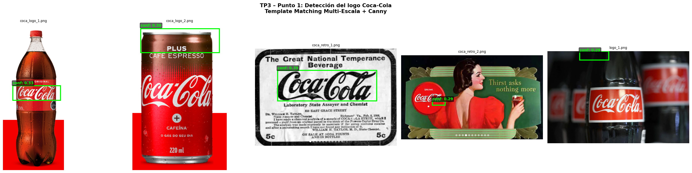

# TP3 – Punto 1: Detección del Logo Coca-Cola

## 1. Objetivo

Detectar el logotipo de Coca-Cola en un conjunto de imágenes utilizando el template provisto (`pattern.png`), obteniendo una única detección por imagen visualizada con su bounding box y nivel de confianza.

---

## 2. Método

Se utilizó **Template Matching multi-escala** combinando dos representaciones de imagen para mayor robustez:

- **Escala de grises:** efectivo para imágenes B&W (`coca_retro_1`).
- **Bordes Canny:** más robusto a variaciones de color e iluminación en logos en color.

### Algoritmo paso a paso

1. **Recorte del template:** se eliminan los bordes blancos sin información para evitar falsos positivos en zonas claras de la imagen.

2. **Pirámide de escalas:** se redimensiona el template entre `0.1x` y `3.0x` en 200 pasos. El TM estándar solo es invariante a traslación; la pirámide le agrega invarianza a escala.

3. **Doble matching por escala:** para cada tamaño se calcula `cv2.matchTemplate` con `TM_CCOEFF_NORMED` en las dos representaciones (gris y Canny) y se conserva el score más alto.

4. **Localización:** `cv2.minMaxLoc()` identifica el máximo del mapa de correlación `R(x,y)`, determinando la posición del bounding box.

5. **Umbral de confianza:** `0.27`. Tamaño mínimo del logo: `60px` de ancho (para evitar falsos positivos a escalas muy pequeñas).

### Métrica utilizada

`TM_CCOEFF_NORMED` mide la correlación cruzada normalizada entre el template T y la región de la imagen I:

```
R(x,y) = Σ(T' · I') / sqrt(Σ T'² · Σ I'²)
```

donde `T'` e `I'` son las versiones con media restada. El resultado está en `[-1, 1]`, lo que permite usar un umbral fijo independiente del brillo de la imagen.

---

## 3. Resultados

| Imagen | Confianza | Detección | Observación |
|---|---|---|---|
| `coca_logo_1.png` | 0.33 | ✅ | Correcta. Bbox sobre el lettering de la etiqueta. |
| `coca_logo_2.png` | 0.30 | ⚠️ | Detecta zona "PLUS CAFÉ ESPRESSO" por estructura de bordes similar al template. |
| `coca_retro_1.png` | 0.70 | ✅ | Mejor resultado. Imagen B&W y logo grande facilitan el matching. |
| `coca_retro_2.png` | 0.29 | ✅ | Bbox sobre el círculo rojo con el logo. |
| `logo_1.png` | 0.29 | ⚠️ | Bbox en zona superior, score bajo por variación de perspectiva e iluminación. |

### Visualización



*Figura 1: Detecciones sobre las 5 imágenes. Verde = detección válida (conf ≥ 0.27). Naranja = debajo del umbral.*

---

## 4. Análisis y Limitaciones

El método funciona bien cuando el logo es plano y ocupa un área grande (`coca_retro_1`, conf=0.70). En imágenes con variaciones de iluminación, perspectiva o texto de estructura similar al template, el score baja y la localización puede ser incorrecta.

Esto se debe a las limitaciones inherentes del Template Matching:

- **No es invariante a rotación ni a deformaciones afines.** Si el logo aparece levemente inclinado o en perspectiva, la correlación cae.
- **Confunde regiones con estructura de bordes similar.** En `coca_logo_2`, la zona "PLUS CAFÉ ESPRESSO" tiene texto blanco sobre oscuro con bordes similares al template, generando una detección incorrecta.
- **Scores bajos (~0.30) en imágenes reales.** La presencia de ruido, reflejos y variaciones de iluminación reduce la discriminabilidad del método.