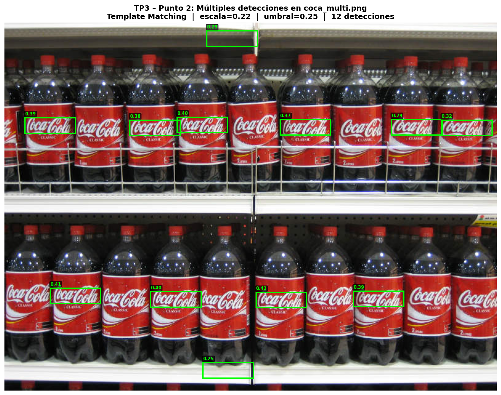

## 1. Objetivo

Detectar **todas las ocurrencias** del logo Coca-Cola en la imagen `coca_multi.png` usando el mismo template del punto 1, sin falsos negativos relevantes.

---

## 2. Problema con el Punto 1

El método del punto 1 usaba `cv2.minMaxLoc()` directamente, lo que devuelve **un único máximo global** del mapa de correlación. Para múltiples detecciones necesitamos encontrar todos los picos que superen el umbral.

---

## 3. Método

### 3.1 Inversión del template

El template (`pattern.png`) tiene el logo en **rojo sobre fondo blanco**. En la imagen real el logo es **texto blanco sobre fondo rojo**. En escala de grises estas representaciones son opuestas, por eso se invierte el template con `cv2.bitwise_not()`.

Se combinan **tres representaciones** tomando el máximo pixel a pixel:

```python
res_inv   = cv2.matchTemplate(img_gray,  template_inv,   TM_CCOEFF_NORMED)  # texto blanco sobre negro
res_gray  = cv2.matchTemplate(img_gray,  template,       TM_CCOEFF_NORMED)  # gris normal
res_canny = cv2.matchTemplate(img_canny, template_canny, TM_CCOEFF_NORMED)  # bordes

mapa = np.maximum(res_inv, np.maximum(res_gray, res_canny))
```

### 3.2 Detección iterativa (loop minMaxLoc + enmascarado)

Para extraer múltiples picos del mapa de correlación:

1. Buscar el máximo del mapa con `cv2.minMaxLoc()`.
2. Si supera el umbral, guardar la detección.
3. **Enmascarar** esa zona (ponerla en 0) con una ventana centrada en el pico de tamaño ~1x el template — suficiente para suprimir el plateau actual sin eliminar logos vecinos.
4. Repetir hasta que ningún pico supere el umbral.

```python
while True:
    _, max_val, _, max_loc = cv2.minMaxLoc(mapa_trabajo)
    if max_val < THRESHOLD:
        break
    x, y = max_loc
    detecciones.append((x, y, rw, rh, max_val))
    # Máscara centrada de tamaño 1x el template
    pad_x, pad_y = rw // 2, rh // 2
    mapa_trabajo[y-pad_y : y+rh+pad_y,
                 x-pad_x : x+rw+pad_x] = 0
```

### 3.3 Parámetros

| Parámetro | Valor | Justificación |
|---|---|---|
| Escala | 0.22 | Elegida por análisis exploratorio (mejor conf global) |
| Umbral | 0.25 | Equilibrio entre detecciones correctas y falsos positivos |
| Tamaño template | 82×25 px | Resultado de aplicar escala 0.22 al template recortado |

---

## 4. Resultados

**12 detecciones** — 10 correctas sobre logos reales, 2 falsos positivos en el separador central de la góndola.



---

## 5. Análisis

El método iterativo funciona correctamente para logos del mismo tamaño en una misma imagen. Los 2 falsos positivos ocurren porque el separador vertical entre estantes tiene una estructura de bordes similar al template a esa escala — limitación inherente del TM sin verificación de contexto.
