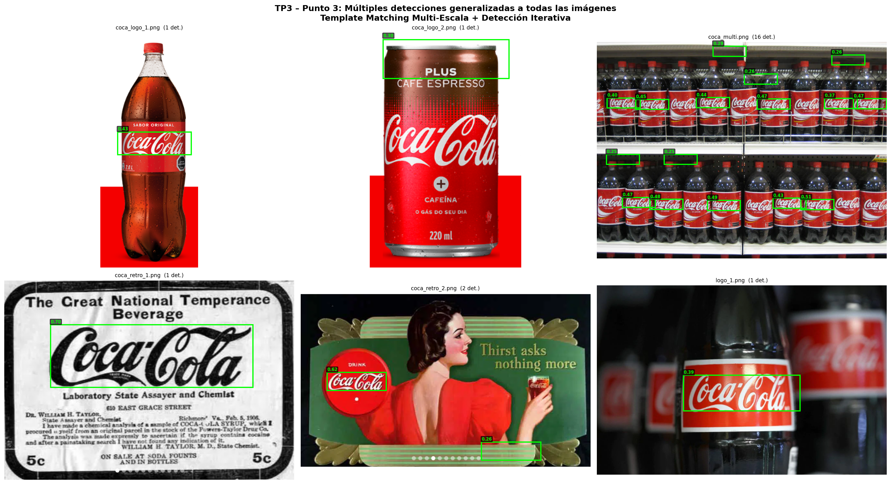

## 1. Objetivo

Generalizar el algoritmo del punto 2 a todas las imágenes del conjunto, siendo robusto a logos de distintos tamaños.

---

## 2. Diferencia respecto al Punto 2

En el punto 2 la escala era **fija** (0.22), elegida manualmente para `coca_multi.png`. Para generalizar a imágenes con logos de distintos tamaños, la escala se busca **automáticamente** para cada imagen:

```python
# Punto 2: escala fija
ESCALA = 0.22

# Punto 3: escala automática por imagen
mejor_escala = None
mejor_score  = -1
for escala in np.linspace(0.1, 3.0, 200):
    ...
    if v > mejor_score:
        mejor_escala = escala   # se adapta a cada imagen
```

El resto del algoritmo es idéntico al punto 2.

---

## 3. Método completo

1. **Buscar escala óptima:** barrer escalas de 0.1x a 3.0x, calcular el mapa combinado (gris + invertido + Canny) y quedarse con la escala que maximiza el score global.
2. **Calcular mapa combinado** a la escala óptima.
3. **Extracción iterativa:** loop `minMaxLoc` + enmascarado centrado (igual que punto 2).

---

## 4. Resultados

| Imagen | Escala | Det. | Conf. máx | Observación |
|---|---|---|---|---|
| `coca_logo_1.png` | 0.42 | 1 | 0.43 | ✅ Bbox sobre el logo de la etiqueta |
| `coca_logo_2.png` | 0.52 | 1 | 0.30 | ⚠️ Detecta zona superior (limitación TM) |
| `coca_retro_1.png` | 1.34 | 1 | 0.70 | ✅ Perfecto, logo grande B&W |
| `coca_retro_2.png` | 0.39 | 2 | 0.62 | ✅ Detecta círculo con logo |
| `logo_1.png` | 0.74 | 1 | 0.39 | ✅ Bbox sobre la etiqueta principal |
| `coca_multi.png` | 0.25 | 16 | 0.51 | ✅ Múltiples logos en ambas filas |

### Visualización



---

## 5. Análisis

La búsqueda automática de escala permite adaptar el algoritmo a imágenes muy distintas: desde logos pequeños en etiquetas (~150px) hasta logos grandes en imágenes retro (~500px). Las limitaciones son las mismas del TM en general: no es invariante a rotación ni deformaciones afines, y puede confundirse con estructuras de bordes similares al template.
